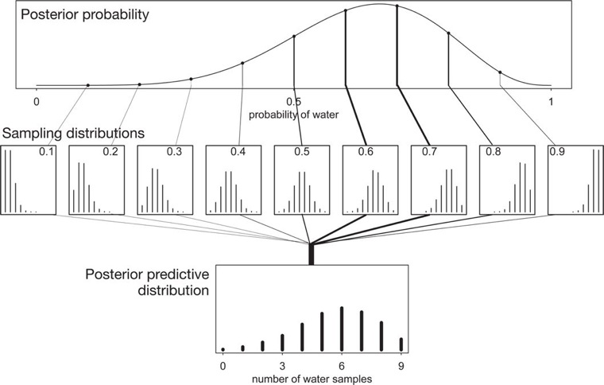

An example of medical test on if a suspect is vampire.

We impliment this example in this r code:

```{r vampire_test, echo=TRUE, message=FALSE, warning=FALSE}
PrPV <- 0.95 # In the case the suspect is vampire, the test is positive. (true positive)
PrPM <- 0.01 # In the case the suspect is mortal, the test is positive. (false pasitive)
PrV <- 0.001 # The propotion of vampire in the suspect.
PrP <- PrPV*PrV + PrPM*(1 - PrV) # The proability the test is positive. This is the average likelihood as well.
( PrVP <- PrPV*PrV / PrP ) # Posterior proability when the test is positive, the suspect is vampire.
```

However, in the sense of Bayesian Theorem, PrVP is better to be estimated by the counts of the conditions:

1. In a population of 100,000 people, 100 of them are vampire.
2. Of the 100 who are vapires, 95 of them will test positive for vampirism.
3. Of the 99,900 motrals, 999 of them will test psitive for vamirism.

Therefore we have PrVP = 95/(95+999) = 0.087


## 1. Sampling from a grid-approximate posterior
```{r GTM, echo=TRUE, message=FALSE, warning=FALSE, cache=TRUE}
## Build global tossing model
p_grid <- seq( from=0 , to=1 , length.out=1000 )
prior <- rep( 1 , 1000 )
likelihood <- dbinom( 6 , size=9 , prob=p_grid )
## We draw the likelihood for every probability of water 
plot(likelihood ~ p_grid) 

# there are 1,000 parameters in this set
posterior <- likelihood * prior  
posterior <- posterior / sum(posterior) 

#  draw 10,000 samples from the posterior of this model
samples_1e4 <- sample( p_grid, prob = posterior, size = 1e4, replace = TRUE)
samples_1e5 <- sample( p_grid, prob = posterior, size = 1e5, replace = TRUE)
samples_1e6 <- sample( p_grid, prob = posterior, size = 1e6, replace = TRUE)

# Look over the samples of GTM from the top
plot(samples_1e4)

plot(samples_1e5)

plot(samples_1e6)

# The density of samples (vertical) at each parameter value (horizontal).
require(rethinking)
dens( samples_1e4 )
dens( samples_1e5 )
dens( samples_1e6 )
```

**More samples drew from the model, the density of samples better match the real distribution.**

## 2. Sampling to summarize
We discuss these questions in three sections:
- How much posterior probability lies below some parameter value?
- How much posterior probability lies between two parameter values?
- Which parameter value marks the lower 5% of the posterior probability?
- Which range of parameter values contains 90% of the posterior probability?
- Which parameter value has highest posterior probability?

### Intervals of defined boundaries
We need to know the posterior probability that the proportion of water is less than 0.5. This could be done by the following code

```{r boundry, echo=TRUE, message=FALSE, warning=FALSE, cache=TRUE}
# add up posterior probability where p < 0.5
sum( posterior[ p_grid < 0.5 ] )
# This shows that 17% of the posterior probability is below 0.5. 

#To divide the resulting count by the total number of samples, it will show the frequency of parameter values below 0.5:
sum( samples_1e4 < 0.5 ) / 1e4

```

- Intervals of defined boundaries: defined by the posterior p.
  *top row of Figure 3.2*


### Intervals of defined mass
**CREDIBLE INTERVAL**:  An interval of posterior probability. There are two parameters:

- Intervals of defined mass: defined by the accumulated density. This could be represented by R code. In the sampling distribution, the lower 80% (posterior p) interval was computed by `quantile(samples_1e6 , 0.8)`, and the middle 80% interval lying between 10% and 90% (the posterior p ) was compuated by `quantile(samples_1e6, c(0.1, 0.9))`
  *bottom row of Figure 3.2*

The intervals of defined mass are called PERCENTILE INTERVALS (PI). In `rethinking` package, there are two functions to compute PI and HIGHEST POSTERIOR DENSITY INTERVAL (HPDI). Here are the example of flat prior function:

```{r flat, echo=TRUE, message=FALSE, warning=FALSE, cache=TRUE}
p_grid <- seq( from=0 , to=1 , length.out=1000 )
prior <- rep(1,1000)
likelihood <- dbinom( 3 , size=3 , prob=p_grid )
posterior <- likelihood * prior
posterior <- posterior / sum(posterior)
samples <- sample( p_grid , size=1e4 , replace=TRUE , prob=posterior )

dens(samples)

## Compute middle 50% PI
PI( samples , prob=0.5 )

## Compute 50% HIGHEST POSTERIOR DENSITY INTERVAL (HPDI).
HPDI( samples , prob=0.5 )
```

PI and HPDI only look dissimilar when the posterior distribution is highly skewed. 

- HPDI is more computationally intensive than PI and suffers from greater simulation variance, which is a fancy way of saying that it is sensitive to how many samples you draw from the posterior. 

**Notes for use of intervals**
-  ... if the choice of interval type makes a big difference, then you shouldn't be using intervals to summarize the posterior. 
- Interval summarizes the relative plausibilities of each possible value of the parameter [in a Bayesian estimataion]. 
- If choice of interval leads to different inferences, then you'd be better off just plotting the entire posterior distribution.


### Point estimates
In Bayesian estimation, there is no proper way to get point estimation.

If it has to be estimated, there are three alternative ways:

```{r point, echo=TRUE, message=FALSE, warning=FALSE, cache=TRUE}
## maximum a posteriori (MAP) estimate
p_grid[ which.max(posterior) ]

##  have samples from the posterior
chainmode( samples_1e6 , adj=0.01 )

## posterior mean or median
mean( samples_1e6 )
median( samples_1e6 )

```

Which estimation is the best? We can count on the loss function. It is a rule that tells you the cost associated with using any particular point estimate. 

In the case prior is flat, the expected proportion loss could be computed by `loss <- sapply( p_grid , function(d) sum( posterior*abs( d - p_grid ) ) )`. `sum( posterior*abs( 0.5 - p_grid ) )` is weighted average loss. The object `loss` contains a list of loss values. The minimum in this list is the index to the posterior that has the minimal loss. This is the other way showing why the posterior mean is the best estimation.


## 3. Sampling to simulate prediction

Four reasons we need simulation:
1. *Model checking* After a model is fit to real data, it is worth simulating implied observations, to check both whether the fit worked correctly and to investigate model behavior. 
2. *Software validation* In order to be sure that our model fitting software is working, it helps to simulate observations under a known model and then attempt to recover the values of the parameters the data were simulated under. 
3. *Research design* If you can simulate observations from your hypothesis, then you can evaluate whether the research design can be effective. In a narrow sense, this means doing power analysis, but the possibilities are much broader. 
4. *Forecasting* Estimates can be used to simulate new predictions, for new cases and future observations. These forecasts can be useful as applied prediction, but also for model criticism and revision. 

There are two ways of simulation in this book:

### Dummy Data
It is still the global tossing model. The dummy data arises from a binomial likelihood:

Suppose *w* is an observed count of “water” and *n* is the number of tosses. Suppose *n* = 2, two tosses of the globe. Then there are only three possible observations: 0 water, 1 water, 2 water.

Given *p* = 0.7, the likelihoods for every observation are `r dbinom( 0:2, size=2, prob=0.7)`. 

We have the simulation for this condition in use of `rbinom`
```{r 3toss, echo=TRUE, message=FALSE, warning=FALSE}

dummy_w <- rbinom( 1e5 , size=2 , prob=0.7 )
table(dummy_w)/1e5

```

When the tosses increase to 9, we have the simulation like this:
```{r 9toss, echo=TRUE, message=FALSE, warning=FALSE}
dummy_w <- rbinom( 1e5 , size=9 , prob=0.7 )
require(rethinking)
simplehist( dummy_w , xlab="dummy water count" )
```

### Model Checking
There are two meanings: (1) ensuring the model fitting worked correctly and (2) evaluating the adequacy of a model for some purpose.

*1. Did the software work?*  
*Retrodictions* How well the model reproduces the data used to educate it. Becareful, there is always the mistake happened in the process of retrodictions.

*2. Is the model adequate?*  
Goal: How the model fails to describe the data, as a path towards model comprehension, revision, and improvement.  

[Chapter 6]() will discuss the imperfect prediction of model.  

This question refers to the goal of this work:  
`how to combine sampling of simulated observations, ..., with sampling parameters from the posterior distribution`  
This work will need the entire posterior distribution because there is a lot of information about uncertainty in the entire posterior distribution.   

**Why the model is uncertain?**  
1. there is observation uncertainty. 
There is uncertainty in the predicted observations, because even if you know p with certainty, you won't know the next globe toss with certainty (unless p = 0 or p = 1).  
2. there is uncertainty about *p*.  
The uncertainty in p will interact with the sampling variation, when we try to assess what the model tells us about outcomes.  

**posterior predictive distribution** For each possible value of the parameter p, there is an implied distribution of outcomes. There are the methods we need to learn or create to compute and illustrate it. The posterior predictive distribution of nine-tossing model is illustrated in Figure 3.6.




When we take *p* = 0.6 from the posterior probability distribution, we could build the sampling distribution of the predictive observations given this value.
```{r predict6, echo=TRUE, message=FALSE, warning=FALSE}
w <- rbinom( 1e4 , size=9 , prob=0.6 )
require(rethinking)
simplehist(w)
```

This plot illustrate how uncertainty *p* = 0.6 as the estimation of the parameter.  

When we avarage all 10 estimations, we have a **averaging posterior predictive distribution** as the bottom of [Figure 3.6](Fig3-6.jpg).  

```{r APPD, echo=TRUE, message=FALSE, warning=FALSE}
w <- rbinom( 1e4 , size=9 , prob=samples_1e4 )
require(rethinking)
simplehist(w)
```

This plot shows that the predictive outcomes of *p* = 0.6 have the least uncertainty.  

However, this eavluation is limited to the condtion *Each toss of the globe is completely independent of the others*. Violated this assumption, more correlations of factors have to be considered in the evaluation. But whether or not the mis-specification should lead us to try other models will depend upon our specific interests.   
